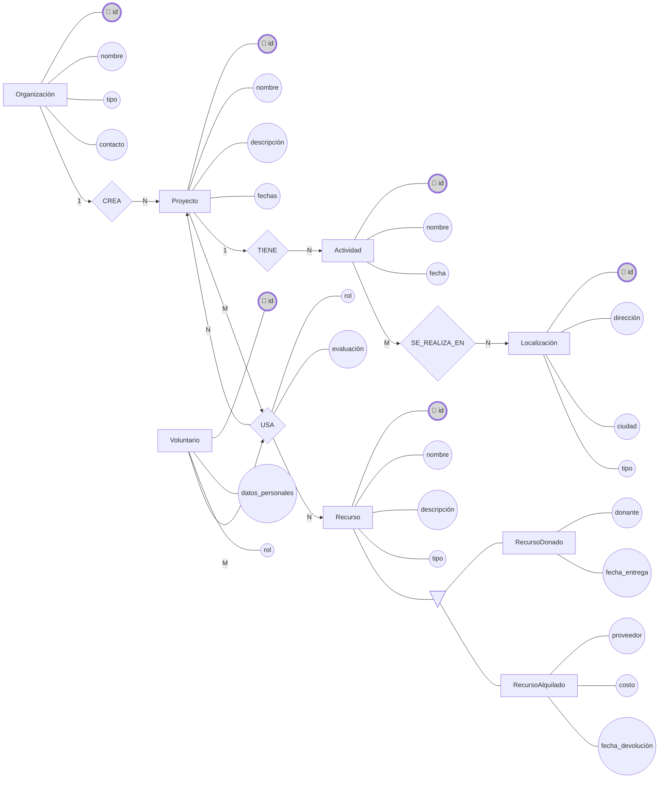

# AyDBD 2025/26 - Proyecto HelpNet

**Fecha:** 16 de noviembre de 2025
**Autores:** alu0101474311@ull.edu.es (Tomás Pino Pérez)

# 0. Introducción
El proyecto consiste en diseñar e implementar una base de datos relacional completa junto con un API REST que permita gestionar un escenario original con entidades, relaciones y reglas de negocio. Se requiere elaborar un modelo conceptual ER que incluya entidades débiles, relaciones triples, jerarquías IS_A, relaciones 1:N y M:N, y al menos un caso de inclusión o exclusión; derivar el grafo relacional con claves, dominios y restricciones; implementar los scripts SQL en PostgreSQL con carga de datos de ejemplo, consultas de prueba y triggers/checks/assertions; y desarrollar un API REST en Flask documentando los endpoints con descripción, método HTTP y ejemplos de petición y respuesta.

# 1. Descripción del modelo
**Idea general:** HelpNet gestiona **organizaciones sin ánimo de lucro**, **proyectos sociales**, **voluntarios**, **actividades**, **localizaciones**, **recursos (donados o alquilados)** y **colaboraciones con voluntarios externos**. Permite registrar participaciones, uso de recursos y relaciones entre organizaciones y voluntarios.

**Entidades fuertes:**
- **Organización:** id, nombre, tipo, contacto
- **Proyecto:** id, nombre, descripción, fechas, FK→Organización
- **Voluntario:** id, datos personales, habilidades/rol
- **Actividad:** id, nombre, fecha, FK→Proyecto
- **Localización:** id, dirección, ciudad, tipo
- **Recurso (IS_A):** id, nombre, descripción, tipo

**Subtipos IS_A (mutuamente excluyentes):**
- **RecursoDonado:** donante, fecha entrega
- **RecursoAlquilado:** proveedor, costo, fecha devolución

**Entidades débiles:**
- **ParticipaciónVoluntario (Voluntario–Proyecto):** rol, evaluación
- **ActividadLocalización (Actividad–Localización)**

**Relaciones:**
- **CREA:** Organización→Proyecto (1:N)
- **TIENE:** Proyecto→Actividad (1:N)
- **SE_REALIZA_EN:** Actividad→Localización (M:N)
- **PARTICIPA:** Voluntario→Proyecto (M:N, atributos: rol, evaluación)
- **USA:** Proyecto→Recurso (M:N)
- **COLABORA:** Organización–Proyecto–VoluntarioExterno (triple, con fecha y tipo de ayuda)

**Restricciones clave:**
- Exclusividad en recursos (donado o alquilado)
- Dependencia total en entidades débiles
- Inclusividad en actividades con localizaciones

# 2. Modelo Entidad-Relación

